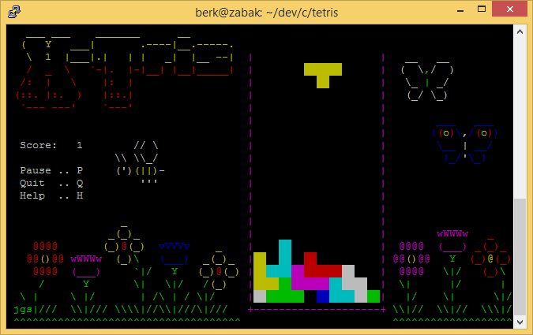
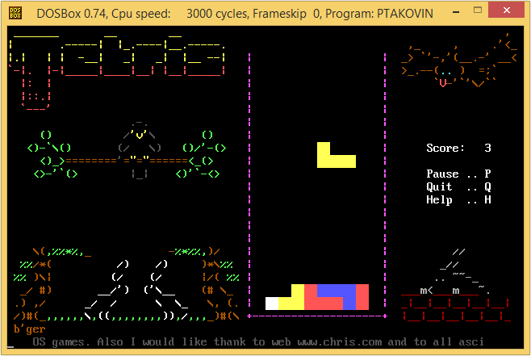
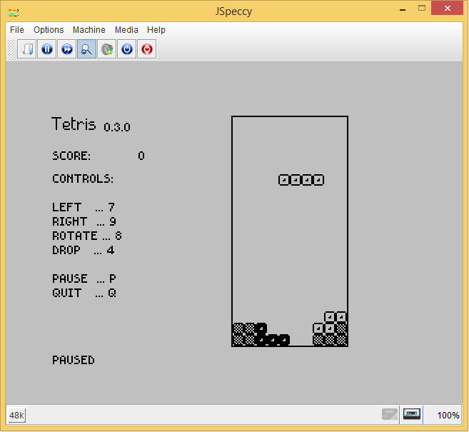
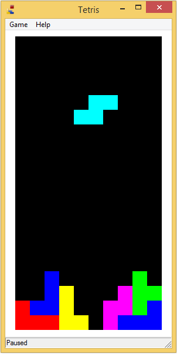

# Tetris

## Supported platforms

### UNIX / Linux Console

#### With ncurses
  1. install ncurses `apt-get install ncurses-dev`
  1. download project `git clone https://github.com/berk76/tetris Tetris`
  1. go into project directory `cd Tetris`
  1. run `make -f Makefile.con`
  1. find and run Tetris

#### Without ncurses
  1. download project `git clone https://github.com/berk76/tetris Tetris`
  1. go into project directory `cd Tetris`
  1. run `make -f Makefile.ans`
  1. find and run Tetris

### DOS
  1. make sure you have Turbo C 2.0 installed
  1. download project `git clone https://github.com/berk76/tetris Tetris`
  1. go to tetris/src directory 
  1. run `make -fMakefile.tc`
  1. find and run ptakovin.exe

### ZX Spectrum
  1. download and install Z88DK c compiler from http://www.z88dk.org
  1. download project `git clone https://github.com/berk76/tetris Tetris`
  1. go into project directory `cd Tetris`
  1. run `make -f Makefile.zx`
  1. find and load tetris.tap

### MS Windows
  1. download and install MinGw from http://www.mingw.org/
  1. download project `git clone https://github.com/berk76/tetris Tetris`
  1. go into project directory `cd Tetris`
  1. run `make -f Makefile.w32`
  1. find and run Tetris.exe

